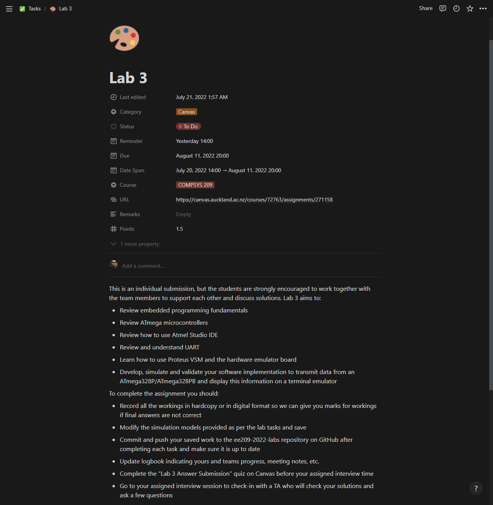
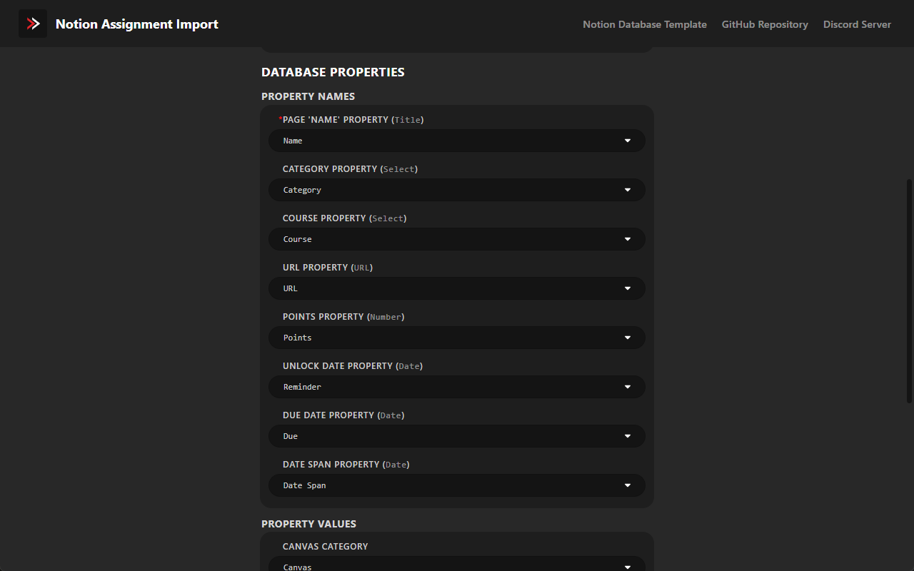

<div align="center">
   
   <br>
   <br>
   <div>
      <a href="https://github.com/JamesNZL/notion-assignment-import/issues">
         
      </a>
      <a href="https://github.com/JamesNZL/notion-assignment-import/pulls">
         
      </a>
      <a href="https://github.com/JamesNZL/notion-assignment-import/actions/workflows/npm-gulp.yml">
         
      </a>
      <a href="https://github.com/JamesNZL/notion-assignment-import/commits">
         
      </a>
   </div>
   <div>
      <a href="https://github.com/JamesNZL/notion-assignment-import/releases">
         
      </a>
      <a href="https://chrome.google.com/webstore/detail/notion-canvas-assignment/elbkjcjgakaoccocmbglokgmalkoacie/">
         
      </a>
      <a href="https://addons.mozilla.org/en-GB/firefox/addon/notion-assignment-import/">
         
      </a>
      <a href="releases/safari/">
         
      </a>
   </div>
</div>

# Notion Assignment Import

<br>

<div align="center">
   <div>
      <a href="https://chrome.google.com/webstore/detail/notion-canvas-assignment/elbkjcjgakaoccocmbglokgmalkoacie/">
         
      </a>
      <a href="https://chrome.google.com/webstore/detail/notion-canvas-assignment/elbkjcjgakaoccocmbglokgmalkoacie/">
         
      </a>
   </div>
   <br>
   <div>
      <a href="https://chrome.google.com/webstore/detail/elbkjcjgakaoccocmbglokgmalkoacie/">
         
      </a>
      <a href="https://addons.mozilla.org/en-GB/firefox/addon/notion-assignment-import/">
         
      </a>
      <a href="#safari-instructions">
         
      </a>
      <a href="https://chrome.google.com/webstore/detail/elbkjcjgakaoccocmbglokgmalkoacie/">
         
      </a>
   </div>
   <br>
   <div>
      <a href="https://discord.gg/k2jjmmVPeK">
         
      </a>
   </div>
</div>

<br>

A fully-configurable [Chromium](https://chrome.google.com/webstore/detail/elbkjcjgakaoccocmbglokgmalkoacie/), [Firefox](https://addons.mozilla.org/en-GB/firefox/addon/notion-assignment-import/), and [Safari](#safari-instructions) extension to load [Canvas](https://www.instructure.com/canvas) assignments into a [Notion](https://www.notion.so/) database, at just the click of a button—unlock your full time-management and productivity potential!

- [Features](#features)
- [Screenshots](#screenshots)
  - [Extension Popup](#extension-popup)
  - [Notion Database Examples](#notion-database-examples)
  - [Extension Options](#extension-options)
- [Discord Server](#discord-server)
- [Setup Instructions](#setup-instructions)
  - [Safari Instructions](#safari-instructions)
  - [Configurable Options](#configurable-options)
    - [Advanced Options](#advanced-options)
    - [`Unlock Date`, `Due Date`, and `Date Span`](#what-is-the-difference-between-unlock-date-due-date-and-date-span)
    - [`Course Code Overrides`](#course-code-overrides)
    - [`Page Emojis`](#page-emojis)
- [Troubleshooting](#troubleshooting)
  - [Wrong Timezone](#wrong-timezone)
- [Release Notes](#release-notes)
  - [BREAKING CHANGES](#breaking-changes)
    - [`v5`](#v5)
    - [`v4`](#v4)
  - [`v5.0.0`](#v500)
    - [Migration Instructions](#migration-instructions-1)
  - [`v4.3.0`](#v430)
    - [Migration Instructions](#migration-instructions-2)
- [Building For Local Development](#building-for-local-development)
- [How It Works](#how-it-works)
  - [Assignment Fetching](#assignment-fetching)
  - [Notion Import](#notion-import)
- [Contributors](#contributors)
- [Privacy Policy](#privacy-policy)
- [Licence](#licence)

# Features

- 💄 Simple, user-friendly interface
- 📄 Provided [Notion database template](https://jamesnzl-sandbox.notion.site/c4d73bebd39c4103b96b2edb8be9e0bd?v=9afaf4b4faee4a5a977c00291be06c9e)
- 🔧 Configurable options, with input validation
- 🗄️ `Category` database property for seamless integration into an existing tasks database
- 🔍 No duplication of assignments already in the database
- 📝 Updating previously imported assignments with new Canvas changes
- ⚙️ Fine-tuning of database property names & values
- ✏️ Overriding of Canvas course names
- 😀 Emojis for Notion page icons
- 🧑‍💻 Open source
- 🔒 Private and secure—all data is stored locally. I do not log or save any user data.

# Screenshots

## Extension Popup


## Notion Database Examples




## Extension Options




# Discord Server

To be notified with updates and changelogs, to get in touch, or just to lurk, join the [Discord server](https://discord.gg/k2jjmmVPeK)!


# Setup Instructions

> [!TIP]
> A [setup video](https://share.cleanshot.com/5HqBbpMc) is also available to follow-along with!

1. Install the [Chromium extension](https://chrome.google.com/webstore/detail/elbkjcjgakaoccocmbglokgmalkoacie/), [Firefox add-on](https://addons.mozilla.org/en-GB/firefox/addon/notion-assignment-import/), or [Safari extension](#safari-instructions).

2. Duplicate [this Notion database template](https://jamesnzl-sandbox.notion.site/c4d73bebd39c4103b96b2edb8be9e0bd?v=9afaf4b4faee4a5a977c00291be06c9e) (or create/modify your own!).

3. Click on the options icon to configure the extension.

4. Click `Authorise with Notion` to add the integration to your Notion workspace, and share your relevant database(s).
> [!IMPORTANT]
> There is a known issue when trying to sign in to Notion using the `Continue with Google` option.  
> This is an issue with the browser and cannot be fixed by this extension.  
> If you encounter this issue, please try logging in directly with your email and password.

> [!NOTE]
> for **Safari**  
> Due to [browser API limitations](https://developer.apple.com/documentation/safariservices/safari_web_extensions/assessing_your_safari_web_extension_s_browser_compatibility), OAuth2 is not currently supported. As a temporary stop-gap, support for a Notion Internal Integration has been retained.
> 1. Follow steps **1** and **2** on [this page](https://developers.notion.com/docs/getting-started#step-1-create-an-integration) to create a new Internal Integration.
> 2. Paste the Notion `Internal Integration Token` into the input field.

5. Select the desired target database in the `Database` dropdown.
> [!NOTE]
> Databases that have not been *directly* shared with the integration (ie those which are a child of a shared page) might not immediately appear. Use the `Refresh` button until the desired database appears.

6. Configure the `Property Names` and `Property Values` if necessary.
> [!TIP]
> If you have duplicated my database template, you do not need to change the applied defaults.

7. Configure the `Timezone`, `Course Code Overrides`, and `Page Emojis` options if necessary.
> [!TIP]
> `Course Code Overrides` can be found under **Advanced Options**.  

8. Open the Canvas page for the course you wish to import.
> [!IMPORTANT]
> You should be on a URL that looks something like `https://<canvas.auckland.ac.nz>/courses/72763/**/*`.  
> - `<canvas.auckland.ac.nz>` should be your own institution's Canvas URL.  
> - `/**/*` means that you can be on the course home page, or any subpage—the important part is `/courses/...../`.

9.  Click `Copy from Canvas`.

10.  You should see the course appear in the `Saved Assignments` list.  
    1. Click `Expand` to view a list of individual saved assignments.  
    2. Click `Clear` to remove the saved assignments from storage.

11.  Repeat steps **8** and **9** as desired.

12.  Once you have finished saving assignments, click the `Export to Notion` button to export to your Notion database.

## Safari Instructions

> [!WARNING]
> This is an unsigned extension that is not installed through the Apple App Store.  
> This means that you **will not receive automatic updates**, and you must repeat the below installation steps if you wish to update your extension.  
> This may change in a future update.  
> To be notified of new releases, join the [Discord server](https://discord.gg/k2jjmmVPeK).

1. Download the latest [`notion-assignment-import-safari_latest.zip`](releases/safari/notion-assignment-import-safari_latest.zip) archive from [`releases/safari`](releases/safari/).

2. Unzip the `.zip` archive.

3. Navigate to the file `Notion Canvas Assignment Import` in `Notion Canvas Assignment Import/Content/MacOS`.

4. Open up the `terminal` app. Paste in this command:

```bash
chmod +x
```

1. Drag and drop the `Notion Canvas Assignment Import` file into your terminal window. You should now have something that looks like this:

```bash
chmod +x /Users/YOUR_USERNAME/Downloads/Notion\ Canvas\ Assignment\ Import/Contents/MacOS/Notion\ Canvas\ Assignment\ Import
```

6. Hit `Enter`. You may now close the terminal.

7. Rename the folder `Notion Canvas Assignment Import` to `Notion Canvas Assignment Import.app`.
   > This turns the folder into an app.

8. Now drag and drop the app into the applications folder.

9. Open the app.
   - If you have successfully opened the app, skip to **Step 11**.
   - If you have issues opening the app with an error message saying the app is unsafe, continue below.

10. Open `System Preferences` and go to `Security and Privacy` -> `General`. There should be a prompt about applications from unidentified developers. Click `Open Anyway`. Click `allow` for any further prompts.

11. Reopen the app.

12. Go to `Safari Preferences` -> `Advanced` and enable `Show Develop menu in menu bar`.

13. Go to the `Develop menu` in the menu bar, and click `Allow unsigned extensions`.

14. Go back to `Safari Preferences` and now go to the `Extensions` pane. Enable the extension.

15. Done!

## Configurable Options

| Option                                         | Purpose/Remarks                                                                                                                      |
| ---------------------------------------------- | ------------------------------------------------------------------------------------------------------------------------------------ |
| `Theme`                                        | Whether to use `Light`/`Dark` mode, or use the browser's default (`System`)                                                          |
| `Show Advanced Options`                        | Whether to `Show`/`Hide` the **Advanced Options**                                                                                    |
| `Timezone`                                     | The `TZ` timezone in which to parse and set all dates                                                                                |
| `Assignments Without Due Dates`                | Whether to `Copy`, or `Ignore` Canvas assignments without a set due date                                                             |
| `Internal Integration Token` (**Safari only**) | The `Internal Integration Token` of your Notion integration                                                                          |
| `Database`                                     | The target Notion database                                                                                                           |
| `Page 'Name' Property`                         | The name of the database `Title` property, used to set the assignment name                                                           |
| `Category Property`                            | The name of a database Category property, used to allow grouping of all Canvas assignments together if using a single tasks database |
| `Course Property`                              | The name of a database Course property, used to set the assignment course code                                                       |
| `URL Property`                                 | The name of a database URL property, used to set the assignment URL                                                                  |
| `Points Property`                              | The name of a database Points property, used to set the assignment's points                                                          |
| `Unlock Date Property`                         | The name of a database Reminder property, used to set the assignment unlock date                                                     |
| `Due Date Property`                            | The name of a database Due property, used to set the assignment due date                                                             |
| `Date Span Property`                           | The name of a database Date Span property, used to set the date span of the assignment as `unlock date`–`due date`                   |
| `Canvas Category`                              | The value of a database Category property to categorise all Canvas assignments as                                                    |
| `Past Assignments`                             | Whether to `Import`,  or `Ignore` assignments due in the past                                                                        |
| `Name Changes`                                 | Whether to `Import` (ie update the existing page) or `Ignore` Canvas changes to previously imported assignment names                 |
| `Points Changes`                               | Whether to `Import` (ie update the existing page) or `Ignore` Canvas changes to previously imported assignment points                |
| `Unlock Date Changes`                          | Whether to `Import` (ie update the existing page) or `Ignore` Canvas changes to previously imported assignment unlock dates          |
| `Due Date Changes`                             | Whether to `Import` (ie update the existing page) or `Ignore` Canvas changes to previously imported assignment due dates             |
| `Date Span Changes`                            | Whether to `Import` (ie update the existing page) or `Ignore` Canvas changes to previously imported assignment date spans            |
| `Page Emojis`                                  | Any Notion page emojis to apply                                                                                                      |

### Advanced Options

| Option                       | Purpose/Remarks                                                        |
| ---------------------------- | ---------------------------------------------------------------------- |
| `Display 'Copy JSON' Button` | Whether to `Show`/`Hide` the `Copy JSON` button in the extension popup |
| `Course Code Overrides`      | Any course code overrides to apply                                     |

### What is the difference between `Unlock Date`, `Due Date`, and `Date Span`?

Good question—this was ultimately a design decision I made for maximum flexibility.

| Property      | Purpose                                                         |
| ------------- | --------------------------------------------------------------- |
| `Unlock Date` | Used for the date that an assignment unlocks/becomes available. |
| `Due Date`    | Used for the date that an assignment is due.                    |
| `Date Span`   | Used for the date **span** `Unlock`–`Due`.                      |

This enables many possible use-cases, such as:
   1. Timelines to be created by `Date Span`;
   2. Calendars to be set to:
      1. `Date Span`, or
      2. `Due Date` only.
   3. Reminders to be set independent to the due date;
   4. Manipulation of the start/end dates on a timeline independent to the unlock/due date; and
   5. Sorting assignments by *due date*, rather than only being able to sort by unlock date.
      > Notion doesn't let you sort `Date` (span) properties by their end date—only their start date.

Of course, you are welcome to configure any of these property names to be `❌ Exclude`—these properties are ignored on import.

### `Course Code Overrides`

**Example:** The course title in the page breadcrumb on Canvas is `Course Title`, but you want it to be saved in your database as `COURSE 121`.

Configure `Course Code Overrides` to the following:

| **Canvas Course Code** | **Notion Course Code** |
| ---------------------- | ---------------------- |
| `Course Title`         | `COURSE 121`           |

### `Page Emojis`

**Example:** You want all `COURSE 121` pages to have the 👨‍💻 emoji, and all `COURSE 101` pages to have the 👀 emoji.

Configure `Page Emojis` to the following:

| **Canvas Course Code** | **Notion Course Code** |
| ---------------------- | ---------------------- |
| `COURSE 121`           | `👨‍💻`                    |
| `COURSE 101`           | `✨`                    |

# Troubleshooting

## Wrong Timezone

If your assignments are being imported into Notion in the wrong timezone, please first ensure that you have configured the `Timezone` option correctly.

> [!IMPORTANT]
> After configuring a `Timezone`, you must then `Clear` and re-copy your `Saved Assignments` in the extension popup.  
> Timezone offsets are applied when assignments are initially copied from Canvas, and not when assignments are exported to Notion.

> [!NOTE]
> To prevent erroneous clears, the extension will automatically restore cleared assignments if the extension popup is closed before the `Cleared!` success status is displayed.

# Release Notes

> [!TIP]
> For a full changelog of notable changes, see [`CHANGELOG.md`](CHANGELOG.md).  
> Also see [Releases](https://github.com/JamesNZL/notion-assignment-import/releases).

## BREAKING CHANGES

> [!CAUTION]
> If you are an existing user, you may be affected by these breaking changes following an update.

### `v5`

1. Support has been added to update existing pages with changed assignment details (eg name, due date, points, etc.). This requires an additional integration capability, so existing users must reauthorise with Notion.

### `v4`

1. Support for a configurable Notion `'Status'` property has been removed, as Notion has implemented their own built-in `Status` property. To fix assignments being imported without a `'Status'` value, change your database property to be of type `Status`, and assign a `DEFAULT` value.
   > [Read more here](https://www.notion.so/help/guides/status-property-gives-clarity-on-tasks).

## `v5.0.0`

1. Assignments already imported to Notion can now be updated when details are changed on Canvas. See ([#385](https://github.com/JamesNZL/notion-assignment-import/pull/387)).
1. Past assignments can now be imported to Notion ([#386](https://github.com/JamesNZL/notion-assignment-import/issues/386)).
2. Assignments without due dates are now correctly imported ([#251](https://github.com/JamesNZL/notion-assignment-import/issues/251)).
3. Timezone validation now works as expected ([#252](https://github.com/JamesNZL/notion-assignment-import/issues/252)).
4. `⌘` + `s` can now be used to save changes on the Options page on macOS.

### Migration Instructions

1. Existing users must reauthorise with Notion, as a new `Update Content` permission is required.

## `v4.3.0`

1. Notion pages now include the assignment's Canvas description ([#59](https://github.com/JamesNZL/notion-assignment-import/issues/59)).
2. Added support for a new 'Points' `number` database property ([#61](https://github.com/JamesNZL/notion-assignment-import/issues/61)) to tag the assignment's points value.
3. Changed the colour of **Advanced Options** headings to ease identification.
4. Renamed `Available Date` to `Unlock Date`.

### Migration Instructions

1. To leverage the new support for a `Points` property, you must create a new Notion [`number`](https://www.notion.so/help/database-properties) database property, and configure it on the Options Page.

# Building For Local Development

This project uses [`gulp`](https://gulpjs.com/) and [`esbuild`](https://esbuild.github.io/) under the bonnet to bundle the compiled JavaScript files to be browser-ready.

1. Fork/clone this repository.

2. Run `npm ci --include=dev` to install the required dependencies.

3. Run the appropriate build script:
   1. `npm run watch` to build in watch mode.
   2. `npm run debug` to build source-mapped, non-minified `dist` files that are easier to debug.
   3. `npm run build` for minified `dist` files.

4. A `dist/` directory will be created containing a separate extension root folder for each supported vendor.

# How It Works

## Assignment Fetching

1. The [`fetch.ts`](src/popup/fetch.ts) [content script](https://developer.mozilla.org/en-US/docs/Mozilla/Add-ons/WebExtensions/Content_scripts) is injected into the active Canvas tab.

2. [`window.location`](https://developer.mozilla.org/en-US/docs/Web/API/Location) is used to extract the institution's Canvas [`origin`](https://developer.mozilla.org/en-US/docs/Web/API/Location/origin), as well as the specific [`pathname`](https://developer.mozilla.org/en-US/docs/Web/API/Location/pathname) of the active tab.

3. The `pathname` is matched against a regular expression to extract the Canvas `:course_id`, such as `72763`.

4. A same-host `fetch()` request is made from the active Canvas tab to the following Canvas REST API endpoints, with the logged-in user's cookies:
   1. [`GET /api/v1/courses/:id`](https://canvas.instructure.com/doc/api/courses.html#method.courses.show), to get the course code.
   2. [`GET /api/v1/courses/:course_id/assignment_groups`](https://canvas.instructure.com/doc/api/assignment_groups.html#method.assignment_groups.index), to get a list of assignments.

5. Relevant information is extracted from each [`Assignment`](https://canvas.instructure.com/doc/api/assignments.html) object, and the following configurations applied:
   1. `Course Code Overrides`, and
   2. `Page Emojis`.
> [!NOTE]
> Assignments without an [`unlock_at`](https://canvas.instructure.com/doc/api/assignments.html) date (ie are already unlocked) are set to be unlocked from the top of the next hour, relative to the current time.

6. Fetched assignments are saved by course in browser local storage (see `IFetchedAssignment` and `SavedAssignment` in [`fetch.ts`](src/popup/fetch.ts)).

## Notion Import

7. The OAuth2 token is used to authorise with the [Notion API](https://developers.notion.com/).

8. The saved assignment data is retrieved from local storage.

9. The configured `Database` is queried to avoid import of duplicate assignments (by matching assignment URLs).

10. The configured `Database Properties` are used to create a new database page for each assignment with the Notion API.

# Contributors

1. Thank you to [@PolarWolf314](https://github.com/PolarWolf314) for doing the conversion work to add Safari support!
2. Thank you to [@MatthewLamperski](https://github.com/MatthewLamperski) for [#89](https://github.com/JamesNZL/notion-assignment-import/pull/89)!
3. Thank you to [@brandon-mason](https://github.com/brandon-mason) for [#424](https://github.com/JamesNZL/notion-assignment-import/pull/424)!

# Privacy Policy

In a nutshell, I store only what data is absolutely necessary.
This data is stored locally, and is never transmitted back to me.

Refer to the [Privacy Policy](./PRIVACY.md) for my full privacy policy.

# Licence

`notion-assignment-import` is licensed under MIT [*modified with a Commons Clause*](https://commonsclause.com/).

Basically, don't try to re-badge and monetise this extension.

This extension began as a free, open-source hobby project to help University students save time—no adverts, no data mining, no other asterisks.

I am firm on it remaining as such.
