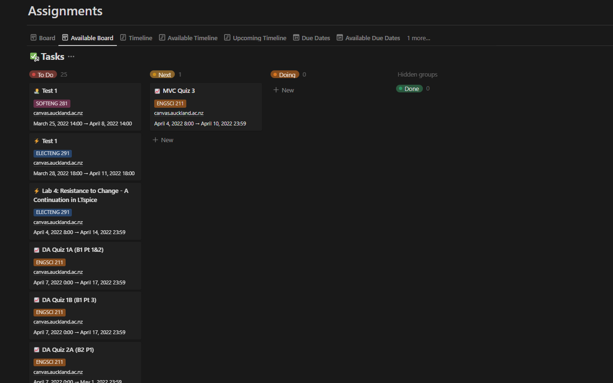
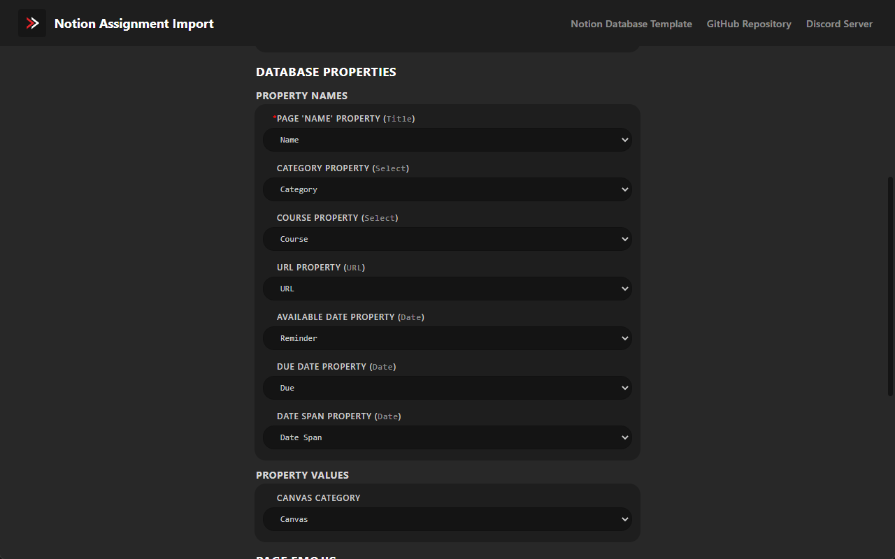

<div align="center">
   
   <br>
   <br>
   <div>
      <a href="https://github.com/JamesNZL/notion-assignment-import/issues">
         
      </a>
      <a href="https://github.com/JamesNZL/notion-assignment-import/pulls">
         
      </a>
      <a href="https://github.com/JamesNZL/notion-assignment-import/actions/workflows/npm-gulp.yml">
         
      </a>
      <a href="https://github.com/JamesNZL/notion-assignment-import/commits">
         
      </a>
   </div>
   <div>
      <a href="https://github.com/JamesNZL/notion-assignment-import/releases">
         
      </a>
      <a href="https://chrome.google.com/webstore/detail/notion-canvas-assignment/elbkjcjgakaoccocmbglokgmalkoacie/">
         
      </a>
      <a href="https://addons.mozilla.org/en-GB/firefox/addon/notion-assignment-import/">
         
      </a>
      <a href="releases/safari/">
         
      </a>
   </div>
</div>

# Notion Assignment Import

<br>

<div align="center">
   <div>
      <a href="https://chrome.google.com/webstore/detail/elbkjcjgakaoccocmbglokgmalkoacie/">
         
      </a>
      <a href="https://addons.mozilla.org/en-GB/firefox/addon/notion-assignment-import/">
         
      </a>
      <a href="#safari-instructions">
         
      </a>
      <a href="https://chrome.google.com/webstore/detail/elbkjcjgakaoccocmbglokgmalkoacie/">
         
      </a>
   </div>
   <br>
   <div>
      <a href="https://discord.gg/k2jjmmVPeK">
         
      </a>
   </div>
</div>

<br>

A fully-configurable [Chromium](https://chrome.google.com/webstore/detail/elbkjcjgakaoccocmbglokgmalkoacie/), [Firefox](https://addons.mozilla.org/en-GB/firefox/addon/notion-assignment-import/), and [Safari](#safari-instructions) extension to load [Canvas](https://www.instructure.com/canvas) assignments into a [Notion](https://www.notion.so/) database, at just the click of a button—unlock your full time-management and productivity potential!

- [Features](#features)
- [Screenshots](#screenshots)
  - [Extension Popup](#extension-popup)
  - [Notion Database Examples](#notion-database-examples)
  - [Extension Options](#extension-options)
- [Discord Server](#discord-server)
- [Setup Instructions](#setup-instructions)
  - [Safari Instructions](#safari-instructions)
  - [Configurable Options](#configurable-options)
    - [`Course Code Overrides`](#course-code-overrides)
    - [`Page Emojis`](#page-emojis)
  - [BREAKING CHANGES](#breaking-changes)
- [Building For Local Development](#building-for-local-development)
- [How It Works](#how-it-works)
  - [Assignment Parsing](#assignment-parsing)
  - [Notion Import](#notion-import)
- [Contributors](#contributors)

# Features

- Simple, user-friendly interface
- Provided [Notion database template](https://jamesnzl-sandbox.notion.site/c4d73bebd39c4103b96b2edb8be9e0bd?v=9afaf4b4faee4a5a977c00291be06c9e)
- Configurable options, with input validation
- `Category` database property for seamless integration into an existing tasks database
- Fine-tuning of database property names & values
- Overriding of Canvas course names
- Emojis for Notion page icons
- Open source
- Private and secure—all data is stored locally!
	> My integration does not save or log any user data.

# Screenshots

## Extension Popup


## Notion Database Examples



## Extension Options




# Discord Server

To be notified with updates and changelogs, to get in touch, or just to lurk, join the [Discord server](https://discord.gg/k2jjmmVPeK)!


# Setup Instructions

1. Install the [Chromium extension](https://chrome.google.com/webstore/detail/elbkjcjgakaoccocmbglokgmalkoacie/), [Firefox add-on](https://addons.mozilla.org/en-GB/firefox/addon/notion-assignment-import/), or [Safari extension](#safari-instructions).

2. Duplicate [this Notion database template](https://jamesnzl-sandbox.notion.site/c4d73bebd39c4103b96b2edb8be9e0bd?v=9afaf4b4faee4a5a977c00291be06c9e) (or create/modify your own!).

3. Click on the options icon to configure the extension.

4. Click `Authorise with Notion` to add the integration to your Notion workspace, and share your relevant database(s).
   > **Safari:** Due to [browser API limitations](https://developer.apple.com/documentation/safariservices/safari_web_extensions/assessing_your_safari_web_extension_s_browser_compatibility), OAuth2 is not currently supported. As a temporary stop-gap, support for a Notion Internal Integration has been retained.  
   1. Follow steps **1** and **2** on [this page](https://developers.notion.com/docs/getting-started#step-1-create-an-integration) to create a new Internal Integration.
   2. Paste the Notion `Internal Integration Token` into the input field.

5. Select the desired target database in the `Database` dropdown.
	> NOTE: Databases that have not been *directly* shared with the integration (ie those which are a child of a shared page) might not immediately appear. Use the `Refresh` button until the desired database appears.

6. Configure the `Property Names` and `Property Values` if necessary.
	> If you have duplicated my database template, you do not need to change the applied defaults.

7. Configure the `Timezone`, `Course Code Overrides`, and `Page Emojis` options if necessary.
   > `Course Code Overrides` can be found under **Advanced Options**.  

   > You should only change the `HTML Class Names` if the extension is not parsing assignments correctly, and you know what you are doing.  
   > If you are running into issues, feel free to ask for help on the [Discord server](https://discord.gg/k2jjmmVPeK)!

8. Open the Canvas Assignments page for the course you wish to import.

9. Click `Copy from Canvas`.

10.  You should see the course appear in the `Saved Assignments` list.  
    1. Click `Expand` to view a list of individual saved assignments.  
    2. Click `Clear` to remove the saved assignments from storage.

11.  Repeat steps **8** and **9** as desired.

12.  Once you have finished saving assignments, click the `Export to Notion` button to export to your Notion database.

## Safari Instructions

> **DISCLAIMER:** This is an unsigned extension that is not installed through the Apple App Store.  
> This means that you **will not receive automatic updates**, and you must repeat the below installation steps if you wish to update your extension.  
> This may change in a future update.  
> To be notified of new releases, join the [Discord server](https://discord.gg/k2jjmmVPeK).

1. Download the latest [`notion-assignment-import-safari_latest.zip`](releases/safari/notion-assignment-import-safari_latest.zip) archive from [`releases/safari`](releases/safari/).

2. Unzip the `.zip` archive.

3. Navigate to the file `Notion Canvas Assignment Import` in `Notion Canvas Assignment Import/Content/MacOS`.

4. Open up the `terminal` app. Paste in this command:

```bash
chmod +x
```

5. Drag and drop the `Notion Canvas Assignment Import` file into your terminal window. Now you should have something looking like this:

```bash
chmod +x /Users/YOUR_USERNAME/Downloads/Notion\ Canvas\ Assignment\ Import/Contents/MacOS/Notion\ Canvas\ Assignment\ Import
```

6. Hit `Enter`. You may now close the terminal.

7. Rename the folder `Notion Canvas Assignment Import` to `Notion Canvas Assignment Import.app`.
   > This turns the folder into an app.

8. Now drag and drop the app into the applications folder.

9. Open the app.
   - If you have successfully opened the app, skip to **Step 11**.
   - If you have issues opening the app with an error message saying the app is unsafe, continue below.

10. Open `System Preferences` and go to `Security and Privacy` -> `General`. There should be a prompt about applications from unidentified developers. Click `Open Anyway`. Click `allow` for any further prompts.

11. Reopen the app.

12. Go to `Safari Preferences` -> `Advanced` and enable `Show Develop menu in menu bar`.

13. Go to the `Develop menu` in the menu bar, and click `Allow unsigned extensions`.

14. Go back to `Safari Preferences` and now go to the `Extensions` pane. Enable the extension.

15. Done!

## Configurable Options

| Option                                         | Purpose/Remarks                                                                                                                      |
| ---------------------------------------------- | ------------------------------------------------------------------------------------------------------------------------------------ |
| `Show Advanced Options`                        | Whether to `Show`/`Hide` the **Advanced Options**.                                                                                   |
| `Timezone`                                     | The `TZ` timezone in which to parse and set all dates                                                                                |
| `Internal Integration Token` (**Safari only**) | The `Internal Integration Token` of your Notion integration                                                                          |
| `Database`                                     | The target Notion database                                                                                                           |
| `Page 'Name' Property`                         | The name of the database `Title` property, used to set the assignment name                                                           |
| `Category Property`                            | The name of a database Category property, used to allow grouping of all Canvas assignments together if using a single tasks database |
| `Course Property`                              | The name of a database Course property, used to set the assignment course code                                                       |
| `URL Property`                                 | The name of a database URL property, used to set the assignment URL                                                                  |
| `Available Date Property`                      | The name of a database Reminder property, used to set the assignment available date                                                  |
| `Due Date Property`                            | The name of a database Due property, used to set the assignment due date                                                             |
| `Date Span Property`                           | The name of a database Date Span property, used to set the date span of the assignment as `available from date`–`due date`           |
| `Canvas Category`                              | The value of a database Category property to categorise all Canvas assignments as                                                    |
| `Page Emojis`                                  | Any Notion page emojis to apply                                                                                                      |

**Advanced Options**

| Option                       | Purpose/Remarks                                                                                                         |
| ---------------------------- | ----------------------------------------------------------------------------------------------------------------------- |
| `Display 'Copy JSON' Button` | Whether to `Show`/`Hide` the `Copy JSON` button in the extension popup                                                  |
| `Breadcrumbs Class`          | Selects the breadcrumb at the top of the page, containing the course code as the `nth li` child element                 |
| `Assignment Class`           | Selects each individual assignment on the page                                                                          |
| `Assignment Title Class`     | Selects the `a` element that contains the assignment URL as the `href` attribute and the assignment name as `innerHTML` |
| `Available Date Class`       | Selects the element containing the assignment available date                                                            |
| `Available Status Class`     | Selects the element containing the text that specifies whether the assignment is already available or not               |
| `Due Date Class`             | Selects the element containing the assignment due date                                                                  |
| `Date Element Class`         | Selects the inner element which directly contains the above dates as `innerHTML`                                        |
| `Course Code nth li`         | Parses the course code as the `nth li` of the `breadcrumbs` parent element                                              |
| `Not Available Status`       | The text within `Available Status Class` that specifies that an assignment is not yet available                         |
| `Course Code Overrides`      | Any course code overrides to apply                                                                                      |

### What is the difference between `Available Date`, `Due Date`, and `Date Span`?

Good question—this was ultimately a design decision I made for maximum flexibility.

| Property         | Purpose                                                         |
| ---------------- | --------------------------------------------------------------- |
| `Available Date` | Used for the date that an assignment unlocks/becomes available. |
| `Due Date`       | Used for the date that an assignment is due.                    |
| `Date Span`      | Used for the date **span** `Available`–`Due`.                   |

This enables many possible use-cases, such as:
   1. Timelines to be created by `Date Span`;
   2. Calendars to be set to:
      1. `Date Span`, or
      2. `Due Date` only.
   3. Reminders to be set independent to the available date;
   4. Manipulation of the start/end dates on a timeline independent to the available/due date; and
   5. Sorting assignments by *due date*, rather than only being able to sort by available date.
      > Notion doesn't let you sort `Date` (span) properties by their end date—only their start date.

Of course, you are welcome to configure any of these property names to be `❌ Exclude`—these properties are ignored on import.

### `Course Code Overrides`

**Example:** The course title in the page breadcrumb on Canvas is `Course Title`, but you want it to be saved in your database as `COURSE 121`.

Configure `Course Code Overrides` to the following:

| **Canvas Course Code** | **Notion Course Code** |
| ---------------------- | ---------------------- |
| `Course Title`         | `COURSE 121`           |

### `Page Emojis`

**Example:** You want all `COURSE 121` pages to have the 👨‍💻 emoji, and all `COURSE 101` pages to have the 👀 emoji.

Configure `Page Emojis` to the following:

| **Canvas Course Code** | **Notion Course Code** |
| ---------------------- | ---------------------- |
| `COURSE 121`           | `👨‍💻`                    |
| `COURSE 101`           | `✨`                    |

## BREAKING CHANGES

### `v4`

1. Support for a configurable Notion `'Status'` property has been removed, as Notion has implemented their own built-in `Status` property. To fix assignments being imported without a `'Status'` value, change your database property to be of type `Status`, and assign a `DEFAULT` value.
   > [Read more here](https://www.notion.so/help/guides/status-property-gives-clarity-on-tasks).

# Building For Local Development

This project uses [`gulp`](https://gulpjs.com/) and [`browserify`](https://browserify.org/) under-the-bonnet to bundle the compiled JavaScript files to be browser-ready.

1. Clone this repository.

2. Run `npm install -D` to install the required dependencies.

3. Run the appropriate build script:
   1. `npm run debug` to build source-mapped, non-minified `dist` files that are easier to debug.
   2. `npm run build` for minified `dist` files.

4. A `dist/` directory will be created containing a separate extension root folder for each supported vendor.

# How It Works

## Assignment Parsing

1. Assignments are parsed from the `DOM` using the configured `Assignment Class`.

2. Assignments are individually parsed for their name, course, URL, available (from) date, and due date:
   1. `Course Code Overrides` are applied,
   2. `Page Emojis` are applied, and
   3. Assignments without due dates are ignored.
   > Assignments without 'available date' information (or that are already available), are set to be available from the top of the next hour (relative to parsing time).

3. Parsed assignments are saved by course in browser local storage in a `JSON`-serialisable format (see `IParsedAssignment` and `SavedAssignment` in [`parse.ts`](src/popup/parse.ts)).

## Notion Import

4. The OAuth2 token is used to authorise with the [Notion API](https://developers.notion.com/).

5. The saved assignment data is retrieved from local storage.

6. The configured `Database` is queried to avoid import of duplicate assignments (by matching assignment URLs).

7. The configured `Database Properties` are used to create a new database page for each assignment with the Notion API.

# Contributors

1. Thank you to [PolarWolf314](https://github.com/PolarWolf314) for doing the conversion work to add Safari support!
