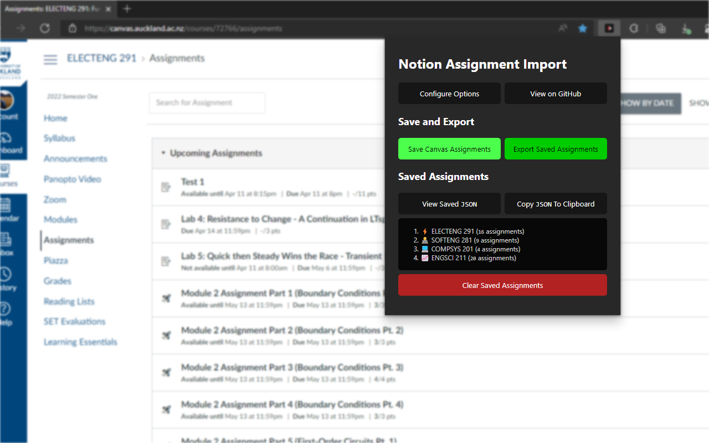
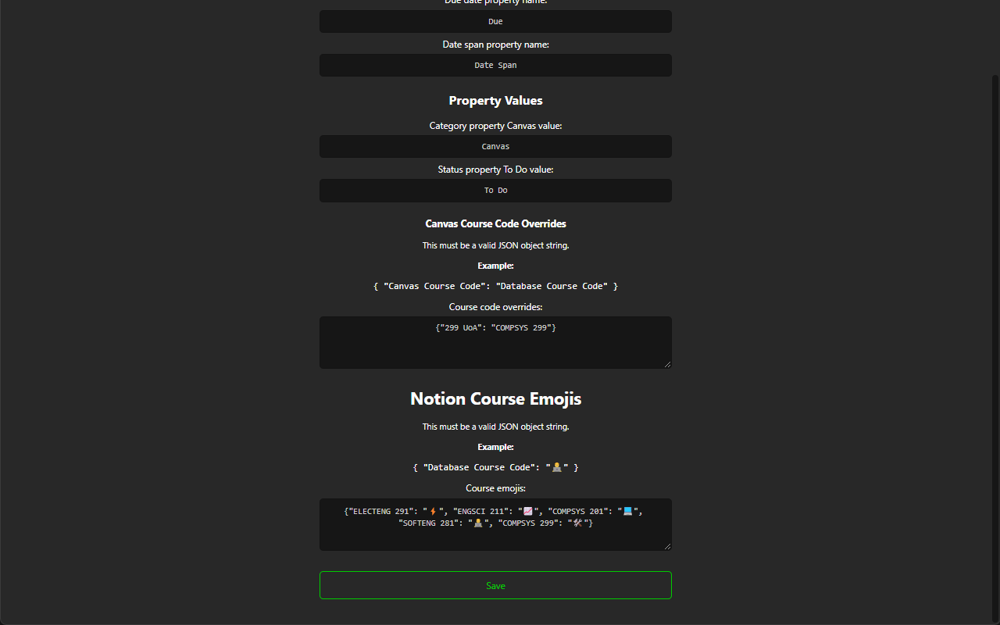

<div align="center">
   
</div>

# Notion Assignment Import

[](https://github.com/JamesNZL/notion-assignment-import/issues)
[](https://github.com/JamesNZL/notion-assignment-import/pulls)
[](https://github.com/JamesNZL/notion-assignment-import/actions/workflows/npm-gulp.yml)
[](https://github.com/JamesNZL/notion-assignment-import/commits)

[](https://github.com/JamesNZL/notion-assignment-import/releases)
[](https://github.com/JamesNZL/notion-assignment-import/blob/master/releases/notion-assignment-import_latest.zip)
[](https://chrome.google.com/webstore/detail/notion-canvas-assignment/elbkjcjgakaoccocmbglokgmalkoacie)

[](https://chrome.google.com/webstore/detail/elbkjcjgakaoccocmbglokgmalkoacie/)
[](https://chrome.google.com/webstore/detail/elbkjcjgakaoccocmbglokgmalkoacie/)

A fully-configurable [Chromium extension](https://chrome.google.com/webstore/detail/elbkjcjgakaoccocmbglokgmalkoacie/) to load [Canvas](https://www.instructure.com/canvas) assignments into a [Notion](https://www.notion.so/) database, at just the click of a button — unlock your full time-management and productivity potential!

- [Features](#features)
- [Screenshots](#screenshots)
  - [Extension Popup](#extension-popup)
  - [Notion Database Examples](#notion-database-examples)
  - [Extension Options](#extension-options)
- [Setup Instructions](#setup-instructions)
  - [Configurable Options](#configurable-options)
    - [Why have `Date span`, on top of `Available date` and `Due date`?](#why-have-date-span-on-top-of-available-date-and-due-date)
    - [`Canvas Course Code Overrides`](#canvas-course-code-overrides)
    - [`Notion Course Emojis`](#notion-course-emojis)
- [How It Works](#how-it-works)
  - [Assignment Parsing](#assignment-parsing)
  - [Notion Import](#notion-import)

# Features

- Simple and user-friendly interface
- Provided [Notion database template](https://jamesnzl-sandbox.notion.site/c4d73bebd39c4103b96b2edb8be9e0bd?v=9afaf4b4faee4a5a977c00291be06c9e)
- Configurable options with input validation
- `Category` database property for seamless integration into an existing tasks database
- Fine-tuning of database property names and values
- Overriding of the course name displayed in Canvas
- Custom emojis for each course to be displayed as Notion page icons
- Open source
- Private and secure — all data is stored locally, and loaded by your own Notion Integration!

# Screenshots

## Extension Popup


## Notion Database Examples


## Extension Options




# Setup Instructions

1. [Install the extension](https://chrome.google.com/webstore/detail/elbkjcjgakaoccocmbglokgmalkoacie/) from the Chrome Web Store.

2. Duplicate [this Notion database template](https://jamesnzl-sandbox.notion.site/c4d73bebd39c4103b96b2edb8be9e0bd?v=9afaf4b4faee4a5a977c00291be06c9e) (or create/modify your own!).

3. Click `Configure Options` to configure the extension.
   1. Create a new Notion Internal Integration, and add it to the desired database.
		> Follow step 1–2 on [this page](https://developers.notion.com/docs/getting-started#step-1-create-an-integration).
      1. Copy and paste your integration key into the `Notion Integration Key` option field.
      2. Copy and paste your database identifier into the `Notion Database ID` option field.

4. Configure the `Timezone` and `Notion Database Properties` if necessary.
	> You should only ever change the `Canvas Class Names` options if the extension is not parsing assignments correctly, and you know what you are doing.

5. Open the Canvas Assignments page for the course you wish to import.

6. Click `Save Canvas Assignments`.

7. You should see the course code appear in the `Saved Assignments` list.
   1. Click `View Saved JSON` to view the raw stored JSON.
   2. Click `List Saved Courses` to return to the ordered list of course codes.
   3. Click `Clear Saved Assignments` to remove the saved assignments from storage.

8. Repeat steps 5–7 as desired.

9. Once you have saved the assignments of all your desired courses, click the `Export Saved Assignments` button to export to Notion.

## Configurable Options

| Option                         | Default Value               | Purpose/Remarks                                                                                                                      |
| ------------------------------ | --------------------------- | ------------------------------------------------------------------------------------------------------------------------------------ |
| Breadcrumbs class              | `ic-app-crumbs`             | Select the breadcrumb at the top of the page, containing the course code as the `nth li` child element                               |
| Course code `nth li`           | `2`                         | Parse the course code, as the `nth li` of the breadcrumbs parent element                                                             |
| Assignment class               | `assignment`                | Select the individual assignments on the page                                                                                        |
| Assignment title               | `ig-title`                  | Select the `a` element that contains the assignment URL as the `href` attribute and the assignment name as `innerHTML`               |
| Available date                 | `assignment-date-available` | Select the element containing the assignment available date information                                                              |
| Available status               | `status-description`        | Select the element containing the text that specifies whether the assignment is already available or not                             |
| Due date                       | `assignment-date-due`       | Select the element containing the assignment due date information                                                                    |
| Date element                   | `screenreader-only`         | Select the `span` element which contains the date as `innerHTML`                                                                     |
| Not available status           | `Not available until`       | The text within `Available status` that specifies that an assignment is not yet available                                            |
| Notion Integration Key         | `null`                      | The integration key of the Notion Internal Integration that is added to the desired database                                         |
| Notion Database ID             | `null`                      | The identifier of the desired database                                                                                               |
| Timezone                       | `Pacific/Auckland`          | The `TZ` timezone in which to parse and set all dates                                                                                |
| Page 'name' property           | `Name`                      | The name of the database Name/Title property, used to set the assignment name                                                        |
| Category property name         | `Category`                  | The name of a database Category property, used to allow grouping of all Canvas assignments together if using a single tasks database |
| Course property name           | `Course`                    | The name of the database Course property, used to set the assignment course code                                                     |
| URL property name              | `URL`                       | The name of the database URL property, used to set the assignment URL                                                                |
| Status property name           | `Status`                    | The name of the database Status property, used to initialise the status of all assignments as `Status property To Do value`          |
| Available date property name   | `Reminder`                  | The name of the database Reminder property, used to set the assignment available (from) date                                         |
| Due date property name         | `Due`                       | The name of the database Due property, used to set the assignment due date                                                           |
| Date span property name        | `Date Span`                 | The name of the database Date Span property, used to set the date span of the assignment as `available from date`–`due date`         |
| Category property Canvas value | `Canvas`                    | The value of the database `Course` property to set all Canvas assignments as                                                         |
| Status property To Do value    | `To Do`                     | The value of the database `Status` property to initialise all Canvas assignments as                                                  |
| Canvas Course Code Overrides   | `{}`                        | A `string` representation of a `JSON` `object` for any course code overrides to apply                                                |
| Notion Course Emojis           | `{}`                        | A `string` representation of a `JSON` `object` for any course emojis to apply                                                        |

### Why have `Date span`, on top of `Available date` and `Due date`?

Good question — this was ultimately a design decision I made for maximum flexibility.

This enables many possible use-cases, such as:
   1. Timelines to be created by `Date span`;
   2. Calendars to be set to:
      1. `Date span`, or
      2. `Due date` only.
   3. Reminders to be set independent to the available date;
   4. Manipulation of the start/end dates on a timeline independent to the available/due date; and
   5. Sorting assignments by *due date*, rather than only being able to sort by available date.
      > There is no ability to sort Notion `Date` (span) properties by their end date — only their start date.

Of course, you are welcome to configure any of these property names to be empty — empty properties are ignored on import.

### `Canvas Course Code Overrides`

Example — the course title in the page breadcrumb is `Course Title`, but you want it to be saved in your database as `CSE 121`.

Configure the `Canvas Course Code Overrides` to the following:

```javascript
{
   "Course Title": "CSE 121"
}
```

For any additional courses, simply separate them with a comma `,`:

```javascript
{
   "Course Title": "CSE 121",
   "Other Course": "OTH 101"
}
```

### `Notion Course Emojis`

Example — you want all `CSE 121` pages to have the ✨ emoji, and all `OTH 101` pages to have the 👀 emoji.

Configure the `Notion Course Emojis` to the following:

```javascript
{
   "CSE 121": "✨",
   "OTH 101": "👀"
}
```

# How It Works

## Assignment Parsing

1. Assignments are parsed from the `DOM` using the configured `Assignment class`.

2. Assignments are individually parsed for their name, course, URL, available (from) date, and due date:
   1. `Canvas Course Code Overrides` are applied as configured,
   2. `Notion Course Emojis` are applied as configured, and
   3. Assignments without due dates are ignored.
   > Assignments without 'available date' information (or are already available), are set to be available from the top of the next hour (relative to parsing time).

3. Parsed assignments are saved by course in Chrome local storage in a `JSON`-serialisable format (see `Assignment` and `SavedAssignment` in [`parseAssignments.ts`](src/scripts/parseAssignments.ts)).

## Notion Import

4. The configured `Notion Integration Key` is used to authenticate with the [Notion API](https://developers.notion.com/).

5. The saved assignment data is retrieved from local storage.

6. The configured `Database ID` is queried to avoid import of duplicate assignments (matching assignment URLs).

7. The configured `Notion Database Properties` are used to create a new database page for each assignment with the Notion API.
