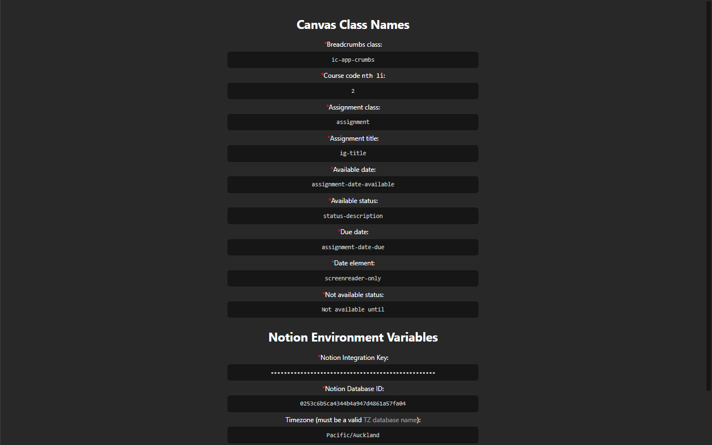

# Usage

1. [Install the extension](https://chrome.google.com/webstore/detail/elbkjcjgakaoccocmbglokgmalkoacie/).

2. Duplicate [this Notion database template](https://jamesnzl-sandbox.notion.site/c4d73bebd39c4103b96b2edb8be9e0bd?v=9afaf4b4faee4a5a977c00291be06c9e).

3. Click `Configure Options` to configure the extension.
   1. Create a new Notion Internal Integration, and add it to the duplicated database.
		> Follow step 1–2 on [this page](https://developers.notion.com/docs/getting-started#step-1-create-an-integration).
      1. Copy and paste your integration key into the `Notion Integration Key` option field.
      2. Copy and paste your database identifier into the `Notion Database ID` option field.

4. Configure the `Timezone` and `Notion Database Properties` if necessary.
	> You should only change the `Canvas Class Names` options if the extension is not parsing assignments correctly, and you know what you are doing.

5. Open the Canvas Assignments page for the course you wish to import.

6. Click `Save Canvas Assignments`.

7. You should see the course code appear in the `Saved Assignments` list.
   1. Click `View Saved JSON` to view the raw stored JSON.
   2. Click `List Saved Courses` to return to the ordered list of course codes.
   3. Click `Clear Saved Assignments` to remove the saved assignments from storage.

8. Repeat steps 5–7 as appropriate.

9. Once you have saved the assignments of all your desired courses, click the `Export Saved Assignments` button to export to Notion.

# Screenshots

## Extension Popup

## Notion Database Example

## Extension Options

